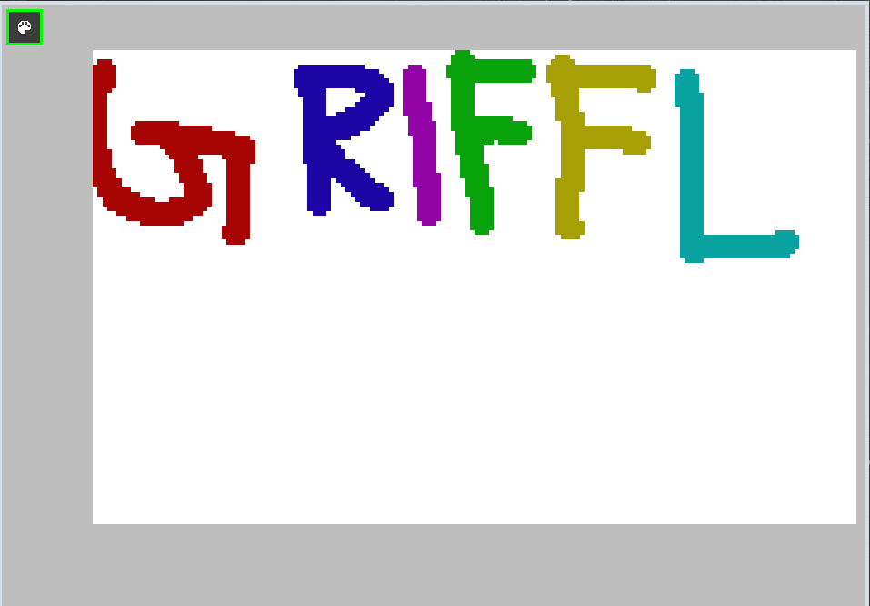

# Griffl

Simple painting program written in C using the SDL2 library.

## Build

For building the project using CMake is recommended.

## Dependencies

* SDL_2
* SDL_Image
* SDL_ttf

## Features

* Responsive canvas that fills all available space
+ Color picker
* Saving canvas as a png
